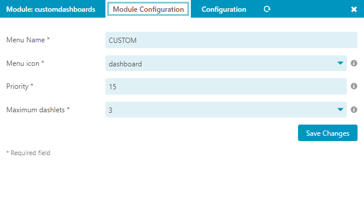
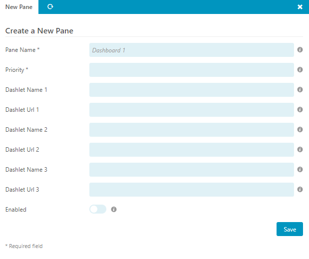
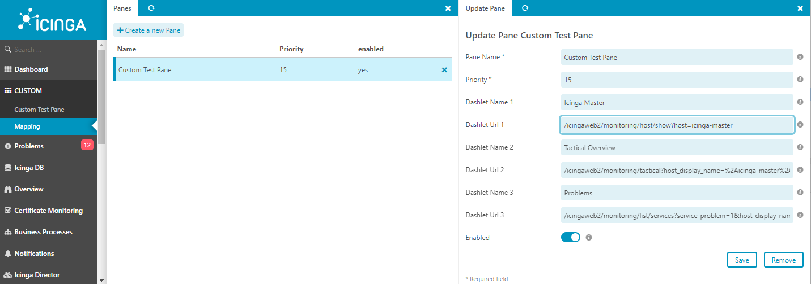
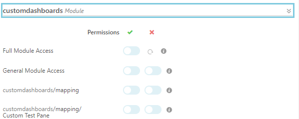

# Configuration <a id="module-customdashboards-configuration"></a>

## Module Configuration  <a id="module-customdashboards-configuration"></a>


| Option                | Required | Description                              |
| --------------------- | -------- | -----------------------------------      |
| Menu Name    | **yes**  | The name of the 'Module' in the menu|
| Menu icon  | **yes**  | The icon shown in the menu|
| Priority             | **yes**  | The priority/position in the menu |
| Maximum dashlets | **yes**  | Maximum dashlets per pane  |

### Create a Mapping  <a id="module-customdashboards-configuration-mapping-create"></a>



| Option                | Required | Description                              |
| --------------------- | -------- | -----------------------------------      |
| Pane Name    | **yes**  | The name of the Pane| 
| Dashlet Name n   | no  | The Name of the dashlet n for example 'Tactical Overview'|
| Dashlet Url n   | no  | The Url of the dashlet n for example '/icingaweb2/monitoring/host/show?host=xxx'|
| Priority             | **yes**  | Priority of the Pane in the menu |
| Enabled               | no       | Enable or disable this entry                    |

### List and update a Mapping  <a id="module-customdashboards-configuration-mapping-list"></a>



## Role Configuration  <a id="module-customdashboards-configuration-role"></a>
This module provides the following permissions:


If you want to restrict a users from accessing the dashboard mapping you can do this in the IcingaWeb2 Roles settings.
> customdashboards/mapping

You will also see an entry for each available dashboard mapping and can allow groups or users to access this dashboard.
> customdashboards/mapping/`<Pane Name>`

Every dashboard you are allowed to see is will be listed in the menu.
## Cli <a id="module-customdashboards-mapping-cli"></a>

Here are some example commands for the CLI:

### Create a Mapping using cli  <a id="module-customdashboards-mapping-cli-create"></a>
```sh
icingacli customdashboards mapping create --name "TEST" --priority 1 --dashletname1 "Priority" --dashleturl1 "/icingaweb2/cube/hosts?dimensions=host%2Cpriority" --dashletname2 "Linux Hosts and Services-Overview" --dashleturl2 "/icingaweb2/monitoring/list/hostgroups?hostgroup=LINUX" --enabled 1
```
### Update a Mapping using cli  <a id="module-customdashboards-mapping-cli-update"></a>
```sh
icingacli customdashboards mapping update --name "TEST" --priority 1
```
### Delete a Mapping using cli  <a id="module-customdashboards-mapping-cli-delete"></a>
```sh
icingacli customdashboards mapping delete --name "TEST"
```