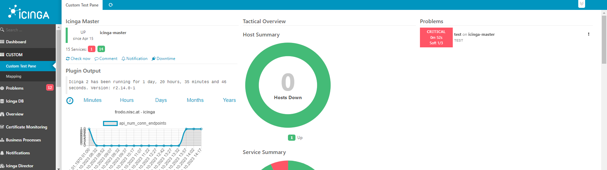

# Usage 

## Module Usage  

Here you see the following mapping:
Pane Custom Test Pane will be shown as a Dashboard under the menu item CUSTOM for all users that have the right permissions.

***Keep in mind that the user needs access to the host and services of the applied dashboards***
